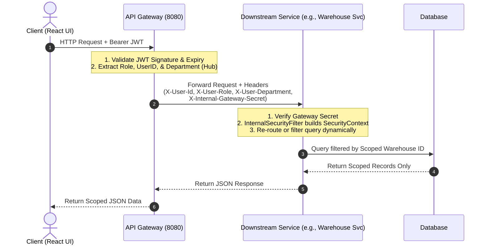
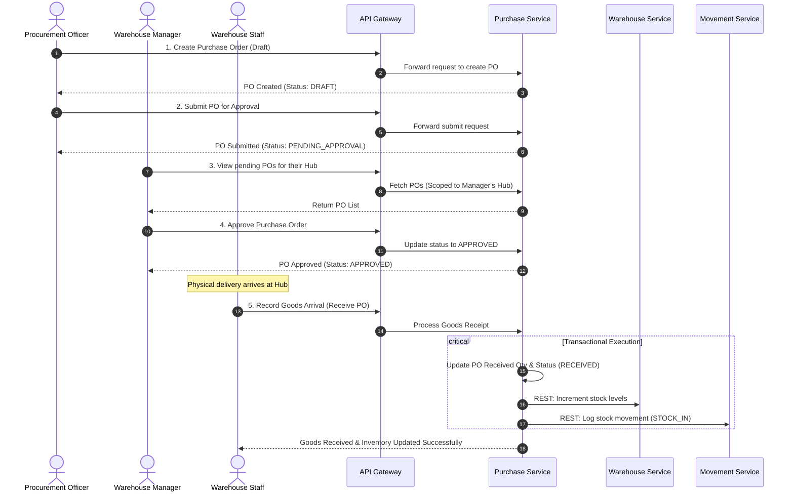

# StockPro: End-to-End Theoretical Flow & System Architecture

StockPro is a distributed, production-grade inventory and procurement management platform designed for multi-warehouse organizations. This document outlines the system architecture, security design, and step-by-step theoretical workflows.

---

## 🏗️ 1. High-Level Architecture Overview

StockPro is built on a **Cloud-Native Microservices** foundation, utilizing Spring Boot for backend services, React with TypeScript for the frontend, and a decentralized database-per-service model.

```mermaid
graph TD
    Client[React Frontend] -->|HTTP / HTTPS| Gateway[Spring Cloud Gateway - Port 8080]
    Gateway -->|Service Registration| Eureka[Eureka Discovery Server - Port 8761]
    
    subgraph Microservices Layer
        Gateway --> AuthSvc[Auth Service - Port 8081]
        Gateway --> ProductSvc[Product Service - Port 8082]
        Gateway --> WarehouseSvc[Warehouse Service - Port 8083]
        Gateway --> PurchaseSvc[Purchase Service - Port 8084]
        Gateway --> SupplierSvc[Supplier Service - Port 8085]
        Gateway --> MovementSvc[Movement Service - Port 8086]
        Gateway --> AlertSvc[Alert Service - Port 8087]
        Gateway --> ReportSvc[Report Service - Port 8088]
    end
    
    subgraph Databases (Isolated Schemas)
        AuthSvc --> DB_Auth[(stockpro_auth)]
        ProductSvc --> DB_Prod[(stockpro_product)]
        WarehouseSvc --> DB_Ware[(stockpro_warehouse)]
        PurchaseSvc --> DB_Purc[(stockpro_purchase)]
        SupplierSvc --> DB_Supp[(stockpro_supplier)]
        MovementSvc --> DB_Move[(stockpro_movement)]
        AlertSvc --> DB_Alert[(stockpro_alert)]
        ReportSvc --> DB_Rep[(stockpro_report)]
    end
```

### Core Architecture Components
1. **API Gateway (`api-gateway`)**: The single entry point for all client requests. It validates JWT tokens, handles routing, and injects tenant headers.
2. **Discovery Server (`discovery-server`)**: A Netflix Eureka service registry where all microservices register themselves to support dynamic load balancing and name-based routing.
3. **Core Services**:
   - `auth-service`: Manages users, credentials, role-based permissions, and Hub assignments.
   - `product-service`: Acts as the master product catalog.
   - `warehouse-service`: Tracks physical warehouse properties, real-time stock levels, reservations, and capacity thresholds.
   - `purchase-service`: Drives the procurement lifecycle (Purchase Orders).
   - `supplier-service`: Manages supplier profiles and metrics.
   - `movement-service`: Records an immutable audit log of all stock movements (Stock-ins, Stock-outs, and Transfers).
   - `alert-service`: Tracks low stock levels and triggers real-time visual alerts.
   - `report-service`: Pulls cross-service data to generate global or hub-specific financial valuations and turnover reports.

---

## 🔒 2. Trust-at-the-Edge Security & Scoping Model

The platform enforces strict **Multi-Tenant Data Isolation** based on the user's role and assigned Hub (Warehouse).

### The Role Hierarchy
*   **Global Roles (Unbound)**: 
    *   `ADMIN`: Complete access to all services, user settings, databases, and global reports.
    *   `OFFICER` (Procurement): Central procurement responsibilities. Can manage suppliers and issue Purchase Orders for any warehouse.
*   **Scoped Roles (Bound to a Hub)**:
    *   `MANAGER`: Local hub authority. Can see stock levels, approve POs, and view analytics *only* for their assigned warehouse.
    *   `STAFF`: Operations hands-on role. Can perform stock transactions (receive, issue, transfer) *only* for their assigned warehouse.

### Data Isolation Engine (How it Works theoretically)



1.  **Header Injection**: The API Gateway intercepts the incoming client request, verifies the JWT, and extracts user details (`userId`, `role`, `department`). It injects these as HTTP headers (`X-User-Id`, `X-User-Role`, `X-User-Department`) into the request forwarded to downstream services.
2.  **Internal Secret Verification**: Downstream services only accept incoming requests that carry a secret key header (`X-Internal-Gateway-Secret`). This prevents users from bypassing the gateway and calling service ports directly.
3.  **Dynamic Context Reconstruction**: Downstream services run an `InternalSecurityFilter` that reads these headers and builds Spring Security's context.
4.  **Database-Level Scoping**: Controllers and services verify if the user's role is scoped (`MANAGER` or `STAFF`). If yes, they resolve the user's department to a warehouse ID and inject database filters. Users *cannot* access other hubs' records even if they request specific database IDs.

---

## 🔄 3. Core End-to-End Business Flows

### Flow A: User Authentication & Session Establishment
1.  **Login Request**: The user enters their credentials in the React UI. A `POST` request is dispatched to `/api/auth/login` (API Gateway routes this to the `auth-service`).
2.  **Verification**: The `auth-service` checks if the user exists and verifies the password using BCrypt.
3.  **Token Generation**: Upon successful validation, the `auth-service` issues a JWT containing custom claims: `userId`, `role`, and `department` (corresponding to the assigned Warehouse Hub, e.g., `"New York Hub"`).
4.  **Client Persistence**: The React client receives the JWT and stores it in memory (state manager) and local storage. Subsequent HTTP requests automatically attach it as a `Bearer` token.

---

### Flow B: The Procurement Lifecycle (Sourcing to Receiving)
This flow shows how goods are ordered from a supplier and received at a specific warehouse hub, triggering multi-service updates.



1.  **Initiating the Purchase Order**:
    *   A **Procurement Officer** logs in, selects a supplier, adds items, defines quantities, and specifies the target Warehouse Hub (e.g., Chicago Warehouse).
    *   The request goes to the `purchase-service`. The PO is persisted with a status of `DRAFT` in the `stockpro_purchase` database.
2.  **Submitting the PO**:
    *   The Officer submits the PO. The status changes to `PENDING_APPROVAL`.
3.  **Manager Approval**:
    *   The **Warehouse Manager** for the Chicago Hub logs in. The UI calls `/purchase-orders` which is automatically scoped to Chicago.
    *   The Manager reviews the PO and clicks **Approve**. The status shifts to `APPROVED`.
4.  **Goods Receipt & Stock Update**:
    *   When the physical delivery truck arrives, a **Warehouse Staff** member at Chicago opens the system and selects the approved PO.
    *   The Staff inputs the received quantities and clicks **Receive**.
    *   The `purchase-service` processes the receipt:
        *   It updates the `received_qty` for each item and marks the status as `RECEIVED` (or `PARTIALLY_RECEIVED`).
        *   It fires a synchronous REST call to `warehouse-service` to adjust inventory.
        *   The `warehouse-service` increments `stock_level` and updates the physical capacity tracking.
        *   A REST call is fired to `movement-service` to write an immutable audit record:
            *   Type: `STOCK_IN`
            *   Metadata: `productId`, `warehouseId`, `quantity`, `referenceId` (PO ID), and `operatorId` (Staff ID).

---

### Flow C: Stock Allocation & Inter-Hub Transfers
Managers or Admins can transfer stock from one warehouse (source) to another (destination) to balance supply.

1.  **Transfer Request**:
    *   An Admin or Manager initiates a transfer: specifying `fromWarehouseId`, `toWarehouseId`, `productId`, and `quantity`.
2.  **Capacity and Stock Check**:
    *   The `warehouse-service` intercepts this request:
        *   It checks if the source warehouse has enough physical stock available (`stock_level - reserved_qty >= requested_qty`).
        *   It checks if the destination warehouse has enough physical capacity (volume/units) to receive the items.
3.  **Inventory Adjustment**:
    *   If checks pass, the `warehouse-service` adjusts the database in a database transaction:
        *   Decrements stock level at the source warehouse.
        *   Increments stock level at the destination warehouse.
4.  **Audit Log Creation**:
    *   The `warehouse-service` requests `movement-service` to log the transaction.
    *   The `movement-service` writes two distinct immutable events to `stockpro_movement.stock_movements`:
        *   Event 1: `TRANSFER_OUT` at the source warehouse.
        *   Event 2: `TRANSFER_IN` at the destination warehouse.

---

### Flow D: Low-Stock Real-time Alerts
1.  **Threshold Violation**:
    *   During any stock reduction operation (e.g., a Sales Issue or Transfer Out), the `warehouse-service` calculates the new stock levels.
    *   If the `stock_level` drops below the predefined `low_stock_threshold` for that product at that hub, it triggers alert tracking.
2.  **Alert Creation**:
    *   The `alert-service` writes a notification entry to `stockpro_alert.alerts`.
3.  **Frontend Notification**:
    *   When Warehouse Staff or Managers view their dashboard, their UI fetches pending alerts scoped to their warehouse. A visual warning indicator alerts them to trigger a new procurement cycle.

---

### Flow E: Financial Valuation & Analytics (Reporting)
1.  **Valuation Query**:
    *   A Manager or Admin views the Reports panel.
2.  **Cross-Service Data Assembly**:
    *   The `report-service` dynamically aggregates data to compute values:
        *   It gets active stock quantities from `warehouse-service`.
        *   It pulls unit costs and prices from `product-service`.
        *   It retrieves recent movement velocities (turnover) from `movement-service`.
3.  **Compilation**:
    *   The service compiles financial metrics (e.g., Total Asset Value in USD, inventory velocity index) and serves them as analytical graphs in the UI.

---

## 🛠️ Summary of Port Mapping & Endpoints

| Service | Port | Primary Database | Key Endpoints / Responsibility |
| :--- | :--- | :--- | :--- |
| **API Gateway** | `8080` | None | Routing, JWT verification, header enrichment |
| **Discovery Server** | `8761` | None | Service Registry (Eureka Dashboard) |
| **Auth Service** | `8081` | `stockpro_auth` | `/auth/login`, `/auth/register` |
| **Product Service** | `8082` | `stockpro_product` | `/products` (Master product details) |
| **Warehouse Service** | `8083` | `stockpro_warehouse` | `/warehouses`, `/warehouses/{id}/stock` |
| **Purchase Service** | `8084` | `stockpro_purchase` | `/purchase-orders`, `/purchase-orders/{id}/receive` |
| **Supplier Service** | `8085` | `stockpro_supplier` | `/suppliers` (Supplier details) |
| **Movement Service** | `8086` | `stockpro_movement` | `/movements` (Immutable history logs) |
| **Alert Service** | `8087` | `stockpro_alert` | `/alerts` (Low-stock alarms) |
| **Report Service** | `8088` | `stockpro_report` | `/reports` (Performance/financial metrics) |
